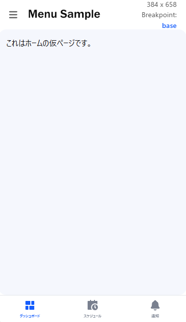

## Getting Started

First, run the development server:

```bash
npx create-next-app@latest nextjs-sidemenu-sample --typescript
```

Open [http://localhost:3000](http://localhost:3000) with your browser to see the result.


## Project Overview

このプロジェクトは、Next.js（15.4.3） で実装されたレスポンシブなサイドバーメニューのサンプルです。  
画面サイズに応じて、サイドバーが自動的に表示形式を切り替えます。
また、ログイン状態によるメニューやページの表示制限も実装されています。

### 環境変数

本プロジェクトを実行するには、ルートディレクトリに `.env.local` ファイルを作成し、以下の環境変数を設定する必要があります。
これらの値は、セキュリティのために任意の安全な値に設定してください。

```
ADMIN_PASSWORD=任意の安全なパスワード
NEXTAUTH_SECRET=任意の長い文字列
```

`NEXTAUTH_SECRET` は、アプリケーションの認証に重要な秘密鍵です。セキュリティを確保するため、本番環境では**非常に長くランダムな文字列**を使用することを強く推奨します。
例として、PowerShellで生成する場合は以下のコマンドを使用できます。

```powershell
[Convert]::ToBase64String((1..32 | ForEach-Object { Get-Random -Maximum 256 }))
```

Git Bashで生成する場合は以下のコマンドを使用できます。

```bash
openssl rand -base64 32
```

### 導入ライブラリ

本プロジェクトでは、以下のライブラリを導入しています。  
詳細なインストール手順については、[導入ライブラリ.md](docs/導入ライブラリ.md) を参照してください。

*   **NextAuth.js**: ユーザー認証機能を提供します。
    *   `next-auth`
    *   `@auth/core`
*   **react-icons**: アイコンを簡単に利用できます。
*   **shadcn/ui**: UI コンポーネントライブラリ。ボタンコンポーネントなどが含まれます。
*   **react-spinners**: ローディングスピナーを提供します。
*   **react-hot-toast**: トースト通知を表示します。

### レスポンシブなサイドバー

このサイドバーメニューは、画面の幅に応じて表示が切り替わります。

#### デスクトップビュー (幅 1024px 以上)

デスクトップ画面では、サイドバーが常に表示されます。メニューボタンをクリックするとアイコンのみの表示に切り替わります。


#### デスクトップビュー (幅 768px 以上)

1024px未満の画面では、サイドバーはデフォルトでアイコンのみの表示となり、メニューボタンをクリックするとオーバーレイメニューが表示されます。


#### モバイルビュー (幅 768px 未満)

モバイル画面では、サイドバーはデフォルトで非表示となり、メニューボタンをクリックするとオーバーレイメニューが表示されます。



